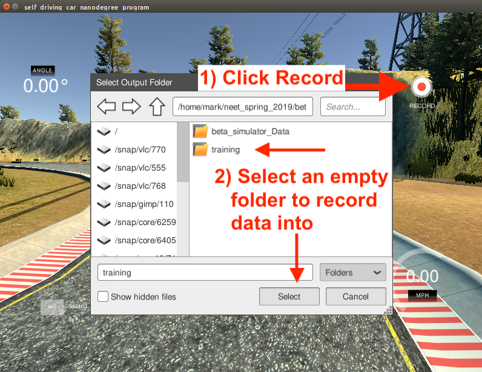
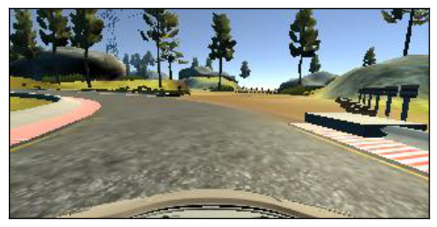

# Imitation Learning Lab

## Introduction

This lab provides an introduction to **end-to-end imitation learning for vision-only navigation** of a racetrack. Let's break that down:

* We will train a deep learning model - specifically, a *convolutional neural network* (CNN) - to regress a steering angle directly from an image taken from the "front bumper" of a car.
* Here, "imitation learning" refers to a branch of supervised machine learning which focuses on imitating behavior from human-provided examples. In our case, we will drive a car around a track several times to provide examples for the CNN to mimic. This learning objective is also frequently termed *behavioral cloning.*
    * We will contrast this with our next lab on "reinforcement learning" where a robot agent learns to accomplish a goal via *exploration*, not via examples.
* "Vision-only" refers to using an RGB camera as the only input to the machine learning algorithm.
    * LIDAR, depth, or vehicle IMU data are not used.
* Here, "end-to-end learning" is shorthand for the CNN's ability to regress a steering angle (i.e., an actuation for the Ackermann steering controller) from unprocessed input data (pixels). We will not need to pre-process input features ourselves, such as extracting corners, walls, floors, or optical flow data. The CNN will learn which features are important, and perform all the steps from *image processing* to *control estimation* itself ("end-to-end", loosely speaking).

We will start by driving a simulated car around a virtual racetrack and collecting camera data from the rendered game engine, as well as our game inputs. We will define a CNN that will regress similar game inputs in order for the car to complete the same track autonomously. Next, we will train the model using camera data and steering angles collected from the RACECAR platform in a real-world environment, the basement in Stata Center, in order for the RACECAR to autonomously drive through the Stata basement.

### In simulation:

| Lake Track  | Jungle Track |
| ----------- | -----------  |
|  |  |


### In Stata basement:

<iframe width="560" height="315" src="https://www.youtube.com/embed/tQCZjKa3Bpw" frameborder="0" allow="accelerometer; autoplay; encrypted-media; gyroscope; picture-in-picture" allowfullscreen></iframe>

This lab and the CNN architecture we will use are based on PilotNet from Nvidia:

* [Nvidia's blog post introducing the concept and their results](https://devblogs.nvidia.com/deep-learning-self-driving-cars/)
* [Nvidia's PilotNet paper](https://arxiv.org/pdf/1704.07911.pdf)
* [Udacity's Unity3D-based Self-Driving-Car Simulator](https://github.com/udacity/self-driving-car-sim) and [Naoki Shibuya's `drive.py` contributions](https://github.com/naokishibuya/car-behavioral-cloning) 

## Part 1: Install required Python libraries and the simulation environment

!!! danger "Heads up!"
    If you are using an account on the NEET server, skip this step! These dependencies are already installed.

### `TensorFlow,` a deep-learning framework

You first need to install [miniconda](https://conda.io/miniconda.html) to install TensorFlow. Download the `Python 3.7` version of miniconda and follow the installation instructions for your platform.

!!! note
    Even though you will be installing `miniconda-python-3.7`, we will be using Python 2.7 to define and train the PilotNet CNN model. `miniconda-python-3.7` will handle creating a Python 2.7 environment for you. Once we save a trained model (also known as saving *weights*), we can later import the saved model in a Python 2.7 ROS environment on the RACECAR.  (To note for completeness, is also possible to train a model with Python 3 and import it with Python 2)


Once you have installed miniconda, clone the following repository locally:

```shell
$ git clone https://github.com/mmaz/imitation_learning_lab
$ cd imitation_learning_lab/
```

Next, we will install TensorFlow using the `conda` command. There are **two** options:

* If you **do not** have a GPU on your computer:
    
```shell
# Use TensorFlow without a GPU
$ conda env create -f environment.yml 
```
    
* Otherwise, if you **do** have a GPU:
    
```shell
# Use TensorFlow with a GPU
$ conda env create -f environment-gpu.yml
```


### Udacity self-driving-car simulator

Download the **Udacity Term 1** simulator for your platform:

* [Linux](https://s3-us-west-1.amazonaws.com/udacity-selfdrivingcar/Term1-Sim/term1-simulator-linux.zip)
* [Mac](https://s3-us-west-1.amazonaws.com/udacity-selfdrivingcar/Term1-Sim/term1-simulator-mac.zip)
* [Windows](https://s3-us-west-1.amazonaws.com/udacity-selfdrivingcar/Term1-Sim/term1-simulator-windows.zip)

The full Unity3D source code of this simulator is available [here](https://github.com/udacity/self-driving-car-sim), as well as other simulators for LIDAR data, waypoint-following, traffic, etc. We will only be using the simulator linked above.

Extract the simulator (which will create a folder called `beta_simulator_linux/`):

```
$ unzip term1-simulator-linux.zip
```

On Linux, you will need to make the simulator executable, via the `chmod` command:

```shell
$ chmod +x ./beta_simulator_linux/beta_simulator.x86_64
```

## Part 2: Defining the PilotNet model

Let us take a closer look at the CNN architecture for PilotNet:

{: style="width:50%;" }

In this lab, we will command a fixed driving velocity and only regress steering angles from images using PilotNet. Hence, the PilotNet CNN has a single output. Using TensorFlow's *Keras API*, let us look at an implementation of the above network in code:

```python
from tensorflow.keras.layers import Lambda, Conv2D, MaxPooling2D, Dropout, Dense, Flatten
from tensorflow.keras.models import Sequential

# you will need to crop or shrink images to the dimensions you choose here:
IMAGE_HEIGHT, IMAGE_WIDTH, IMAGE_CHANNELS = 66, 200, 3
INPUT_SHAPE = (IMAGE_HEIGHT, IMAGE_WIDTH, IMAGE_CHANNELS)

def build_model(dropout_rate=0.5):
    model = Sequential()
    model.add(Lambda(lambda x: x/127.5-1.0, input_shape=INPUT_SHAPE)) #normalizes image data
    model.add(Conv2D(24, (5,5), strides=(2, 2), activation='elu'))
    model.add(Conv2D(36, (5,5), strides=(2, 2), activation='elu'))
    model.add(Conv2D(48, (5,5), strides=(2, 2), activation='elu'))
    model.add(Conv2D(64, (3,3), activation='elu'))
    model.add(Conv2D(64, (3,3), activation='elu'))
    model.add(Dropout(dropout_rate)) 
    model.add(Flatten())
    model.add(Dense(100, activation='elu'))
    model.add(Dense(50, activation='elu'))
    model.add(Dense(10, activation='elu'))
    model.add(Dense(1))
    model.summary()
    return model
```

As configured above, the PilotNet CNN model expects 200x66 crops from the car's camera.

!!! note "Exercise"
    How many trainable parameters are in this model? What is the output volume of each layer?
    
    What is the effect of changing the input size on the total number of parameters in the model?  
    
    **Hint 1:** use `model.summary()` to print out a summary of the network. 

    **Hint 2:** Consider the input to the flattening operation and first dense layer: it is the output volume from the last convolutional layer. How is this affected by changing the input size? What about the next dense layer?
    


For more on TensorFlow's Keras API, [click here](https://tensorflow.org).

!!! note
    Note that Keras will disable **Dropout regularization** at inference time. [See here](https://stackoverflow.com/questions/47787011/how-to-disable-dropout-while-prediction-in-keras) for details.

### Model Output and Optimization

The output of this model is a single neuron, which corresponds to the servo or steering angle to command the car with. In the section on [**Training**](imitation_learning.md#part-3-training-the-model) we will normalize the steering angle training data to fit between (-1, 1), and therefore we should expect regressions from the CNN to also fit between this range.

!!! note "Question"
    Notice that we also normalize the input images in the first layer between (-1,1) Why would we prefer to normalize the input and output data between these ranges?

    **Hint:** Consider the shape, domain, and range of common activation functions.

We will use the [Adam optimizer](https://www.tensorflow.org/api_docs/python/tf/train/AdamOptimizer) with a loss function (i.e., cost or objective function) that minimizes the mean square error betwen the ground-truth steering angles and the currently predicted steering angles:

```python
model = build_model()
model.compile(loss='mean_squared_error', optimizer=Adam(lr=1.0e-4))
```

!!! note "Optional Exercise"
    With only a few changes to the above model and loss definitions, you can add a second output to estimate the velocity as well. This might help your team to complete the course faster! For instance, when you are collecting training data, you might want to drive quickly down straight hallways and slow down during turns. It is feasible to learn this behavior!

## Part 3: Training the Model

We will use three cameras mounted on the simulated car and the real-world RACECAR to collect training data. This excerpt from [Nvidia's blog post](https://devblogs.nvidia.com/deep-learning-self-driving-cars/) explains why doing so is useful:

> *Training data contains single images sampled from the video, paired with the corresponding steering command (1/r). Training with data from only the human driver is not sufficient; the network must also learn how to recover from any mistakes, or the car will slowly drift off the road. The training data is therefore augmented with additional images that show the car in different shifts from the center of the lane and rotations from the direction of the road.*
>
> *The images for two specific off-center shifts can be obtained from the left and the right cameras. Additional shifts between the cameras and all rotations are simulated through viewpoint transformation of the image from the nearest camera. Precise viewpoint transformation requires 3D scene knowledge which we don’t have, so we approximate the transformation by assuming all points below the horizon are on flat ground, and all points above the horizon are infinitely far away. This works fine for flat terrain*

Here is a diagram from Nvidia that describes the training and *data augmentation* process for PilotNet:


### Jupyter Notebook

We will train our models in Jupyter Notebook:

```shell
$ conda activate imitation_learning
(imitation_learning) $ cd imitation_learning_lab
(imitation_learning) $ jupyter notebook
```

Then, open [train_RACECAR_pilotnet.ipynb](https://github.com/mmaz/imitation_learning_lab/blob/master/train_RACECAR_pilotnet.ipynb) in your browser.

### In Simulation

First, create a new folder to store training data from the simulator, e.g. `training/`) and then start the simulator. On linux:

```shell
$ ./beta_simulator_linux/beta_simulator.x86_64
```

Now launch the **Training** mode and configure the simulator to save data to the folder you created:

{: style="width:80%;" }

Once you have configured a folder to record your training data into, press **record** again (or `r` as a shortcut) and start to drive the car around (you can use `WASD` or your arrow keys on your keyboard). If this is your first time running the simulator, stop recording after a few seconds, to inspect the saved results.

The simulator will save three camera views from the car: left, center, and right camera views from the bumper of the car (as jpgs) along with the image filenames and the current steering angle in `driving_log.csv`. 

!!! warning
    Recording will generate a lot of files! Too many files in a single directory can cause performance issues, e.g., when generating thumbnails.
    
    Once you are ready to record full laps of the course, I recommend keeping each recording session to a few laps of the track, and making multiple new folders. This will help to keep the number of files within each folder low, e.g., `two_laps_run1/`, `two_laps_run2/`, etc, or making a folder for tricky sections of the course, e.g., `bridge_section_run1/`. It is easy to concatenate the resulting CSVs in python (using simple list concatenation with `+`)

In the `training/` folder (or whichever folder you just created), you should see `driving_log.csv` and another folder `IMG/`.

`driving_log.csv` contains path locations for the three camera views with associated timestamps (sequentially increasing), and the saved steering angle (without a CSV header):

| Center | Left | Right | Steering Angle | Throttle | Brake | Speed | 
| ------ | ---- | ----- | ----- |----- |----- |----- |
|  `center_2019_03_11_12_22_15_385.jpg`    | `left_2019_03_11_12_22_15_385.jpg`    |   `right_2019_03_11_12_22_15_385.jpg`  | 0 |  0 | 0 | 0 |
|  `center_2019_03_11_12_22_15_502.jpg`    | `left_2019_03_11_12_22_15_502.jpg`    |   `right_2019_03_11_12_22_15_502.jpg`    | 0 | 0 | 0 | 0 |
|  `center_2019_03_11_12_22_15_594.jpg`    | `left_2019_03_11_12_22_15_594.jpg`    |   `right_2019_03_11_12_22_15_594.jpg`    | 0 | 0 | 0 | 0 |


!!! note
    If you would like to change some of the parameters, such as the saved image resolution, or even define a new track, you can rebuild and edit the simulator using [Unity3D](https://unity3d.com/).

    See [this section of the Udacity source code](https://github.com/udacity/self-driving-car-sim/blob/522bd7ad6784ad5de1f12f593e00c7d1d79ec34d/Assets/Standard%20Assets/Vehicles/Car/Scripts/CarController.cs#L428) if you are curious how the image files and CSV data are generated.

In the `training/IMG/` folder you will find `.jpg` files with the following naming scheme corresponding to the above CSV:

| Left | Center | Right |
| ---- | ------ | ----- |
|     |        |      |
|  `center_2019_03_11_12_22_15_385.jpg`    | `left_2019_03_11_12_22_15_385.jpg`    |   `right_2019_03_11_12_22_15_385.jpg`    |


### Train/Validation Split

!!! danger "Regularization"
    With enough training time and enough model parameters, you can perfectly fit your training data! This is called **overfitting** - we will use validation data, image augmentation, and regularization to avoid overfitting.

We will partition our data into training and validation sets. Validation helps to ensure your model is not overfitting on the training data. In the notebook, observe the use of `from sklearn.model_selection import train_test_split.`

```python
imgs = []
angles_rad = [] #normalize between -pi to pi or -1 to 1

with open(driving_data) as fh:
    ########################## #
    ### TODO: read in the CSV  #
    ### and fill in the above  #
    ### lists                  #
    ############################
        
TEST_SIZE_FRACTION = 0.2
SEED = 56709 # a fixed seed can be convenient for later comparisons

X_train, X_valid, y_train, y_valid = train_test_split(
    imgs, 
    angles_rad, 
    test_size=TEST_SIZE_FRACTION, 
    random_state=SEED)
```

### Batch Generation, Checkpointing, and Training Execution

For efficient training on a GPU, multiple examples are sent at once in a *batch* onto the GPU in a single copy operation, and the results of backpropagation are returned from the GPU back to the CPU. You will want to checkpoint your model after each epoch of training. Lastly, `model.fit_generator()` will commence training on your data and display the current loss on your training and testing data:

```python
checkpoint = ModelCheckpoint('imitationlearning-{epoch:03d}.h5',
                             monitor='val_loss',
                             verbose=0,
                             save_best_only=False,
                             mode='auto')

def batch_generator(image_paths, steering_angles, batch_size):
    """
    Generate training image give image paths and associated steering angles
    """
    images = np.empty([batch_size, IMAGE_HEIGHT, IMAGE_WIDTH, IMAGE_CHANNELS])
    steers = np.empty(batch_size)
    while True:
        i = 0
        for index in np.random.permutation(len(image_paths)):

            ##############################################
            # TODO: add your augmentation code here   ####
            ##############################################
            
            image = cv.imread(image_paths[index])
            cropped = image[95:-95, 128:-127, :]
            images[i] = cropped
            
            steering_angle = steering_angles[index]
            steers[i] = steering_angle
            
            i += 1
            if i == batch_size:
                break
        yield images, steers
        
        
BATCH_SIZE=20
model.fit_generator(generator=batch_generator(X_train, y_train, batch_size=BATCH_SIZE),
                    steps_per_epoch=20000,
                    epochs=10,
                    validation_data=batch_generator(X_valid, y_valid, batch_size=BATCH_SIZE),
                    # https://stackoverflow.com/a/45944225
                    validation_steps=len(X_valid) // BATCH_SIZE, 
                    callbacks=[checkpoint],
                    verbose=1)
```

### Driving your car in simulation

After starting the Udacity simulator in **Autonomous Mode** you can use your trained model to drive the car via:

```shell
$ python drive_udacity.py $MODEL_NAME
```

where `$MODEL_NAME` is the name of the saved model checkpoint. For instance, if you used the following checkpoint naming scheme:

```python
ModelCheckpoint('imitationlearning-{epoch:03d}.h5'
    ...)
```

Then `imitationlearning-010.h5` will be the model saved after the tenth epoch of training.

### Image Augmentation

You will want to add some data augmentation to help your model generalize past the specific examples you have collected in the simulator (and on the actual RACECAR). Some example transformations to incorporate:

**Center Image**



**Left and right Images**

```python
def choose_image(data_dir, center, left, right, steering_angle):
    """
    Randomly choose an image from the center, left or right, and adjust
    the steering angle.
    """
    choice = np.random.choice(3)
    if choice == 0:
        return load_image(data_dir, left), steering_angle + 0.2
    elif choice == 1:
        return load_image(data_dir, right), steering_angle - 0.2
    return load_image(data_dir, center), steering_angle
```

 


**Flipped Image**

```python
    if np.random.rand() < 0.5:
        image = cv2.flip(image, 1)
        steering_angle = -steering_angle
    return image, steering_angle
```


**Translated Image**

```python
def random_translate(image, steering_angle, range_x, range_y):
    """
    Randomly shift the image virtially and horizontally (translation).
    """
    trans_x = range_x * (np.random.rand() - 0.5)
    trans_y = range_y * (np.random.rand() - 0.5)
    steering_angle += trans_x * 0.002
    trans_m = np.float32([[1, 0, trans_x], [0, 1, trans_y]])
    height, width = image.shape[:2]
    image = cv2.warpAffine(image, trans_m, (width, height))
    return image, steering_angle
```


### Servo histograms

It is important to ensure the train/test split of the data you have collected have similar driving condition represented. For instance, here is the histogram of servo angles in the training and testing data used above:


### Checkpointing

```python
checkpoint = ModelCheckpoint('model-{epoch:03d}.h5',
                             monitor='val_loss',
                             verbose=0,
                             save_best_only=False,
                             mode='auto')
```                            

### [Optional] Extending to more general environments

It is possible to train a model with driving data from public roads, in order to experiment with how it affects the performance of your car in Stata basement.


!!! danger
    Obviously, you should not test anything on public roads yourself, either on a RACECAR or any other car. Be safe and responsible!


You can find useful public road data from Udacity here: <https://github.com/udacity/self-driving-car/tree/master/datasets>

Another useful public road dataset is here: <https://github.com/SullyChen/driving-datasets>

<!--  -->


# Part 4: RACECAR data collection and training

In this section you will manually collect steering angle data by driving the car around. 

A good first task is to train the RACECAR to drive around some tables in a circle, before tackling Stata basement. You can also define some more intermediate-difficulty courses (figure-eights, snake patterns, etc) to gain intuition on what types of training and validation methods are most effective.

Here is an example of training data collected around some tables in a classroom:

{: style="width:50%;" }

<iframe width="560" height="315" src="https://www.youtube.com/embed/dvyEbNUAKSE" frameborder="0" allow="accelerometer; autoplay; encrypted-media; gyroscope; picture-in-picture" allowfullscreen></iframe>

And here is a third-person view of a car autonomously driving around the same path using PilotNet:

<iframe width="560" height="315" src="https://www.youtube.com/embed/BnLihmE9o0k" frameborder="0" allow="accelerometer; autoplay; encrypted-media; gyroscope; picture-in-picture" allowfullscreen></iframe>

The following script will record images from the three webcams on the RACECAR along with the joystick-commanded steering angle (through `teleop`):

<https://github.com/mmaz/imitation_learning_lab/blob/master/record_RACECAR.py>

```shell
$ python2 record_RACECAR.py
```

!!! note
    Make sure to use **`python2`** here for recording the images and steering angle data - note that we will **not** use `python2` in the next section to access the cameras. TensorFlow is only available in the car's `python3` environment, and ROS is only available in our `python2` environment. For recording, we do not need access to TensorFlow, only OpenCV. For autonomous driving with both TensorFlow and ROS, we will see how to work around this inconvenience in the next section via `zmq`.

When you are done collecting data, press `ctrl-c` to terminate collection:

!!! note
    After you are done with data collection, you might see an error like `TypeError: img data type = 17 is not supported` printed to the terminal when you `ctrl-c` - this is harmless and you can safely ignore this error, which happens because the last jpg was not saved to disk due to the `ctrl-c` interrupt. The rest of the jpgs should be in the saved folder along with a CSV file of jpg filenames, steering angles, and velocities.

Note that **before recording any data** you will need to change the **Video Device IDs** to the appropriate values, depending on which order the webcams were plugged in and registered by Linux.

Set the appropriate values for your car in [`camera_RACECAR.py`](https://github.com/mmaz/imitation_learning_lab/blob/6dd9a61f2c687888de80afe94c2df139490828cd/cameras_RACECAR.py#L3-L5)

```python
class Video:
    # dev/video*
    LEFT = 1
    CENTER = 2
    RIGHT = 0
```

[The following script](https://github.com/mmaz/imitation_learning_lab/blob/master/video_id_RACECAR.py) will display the currently assigned video device IDs on top of the camera feeds, to help verify the IDs are in the correct order:


```
$ python3 video_id_RACECAR.py
```

`python2` should also work above.

{: style="width:100%;" }

Sidenote: you can also set `udev` rules to "freeze" these values for your car, if you frequently find the IDs changing after power-cycling the RACECAR.

After you have collected your training data, transfer the data using `scp` or a flashdrive to your laptop and train your model using [the provided jupyter notebook](https://github.com/mmaz/imitation_learning_lab/blob/master/train_RACECAR_pilotnet.ipynb).

!!! warning "Reminder"
    You should not train a model on the RACECAR - use the course server or your own laptop!

## Part 5: Running inference on RACECAR

To execute a trained model, you will need to run the following scripts:

<https://github.com/mmaz/imitation_learning_lab/blob/master/infer_RACECAR.py>
<https://github.com/mmaz/imitation_learning_lab/blob/master/drive_RACECAR.py>

!!! note
    We use `zmq` to send steering angle messages from our Python3 script running inference with TensorFlow, over to a Python2-ROS script that commands the car to drive.

You will first need to copy your saved model weights to the RACECAR (e.g., using SCP). You will specify the model location using [this command-line argument](https://github.com/mmaz/imitation_learning_lab/blob/6dd9a61f2c687888de80afe94c2df139490828cd/infer_RACECAR.py#L27).

Next, if it has changed (due to a reboot or unplugging the cameras), remember [to **modify the video ID** to the center camera here](https://github.com/mmaz/imitation_learning_lab/blob/6dd9a61f2c687888de80afe94c2df139490828cd/cameras_RACECAR.py#L3-L5), or verify the current ID is correct using [`video_id_RACECAR.py`](https://github.com/mmaz/imitation_learning_lab/blob/master/video_id_RACECAR.py):

```python
class Video:
    # dev/video*
    LEFT = 1
    CENTER = 2
    RIGHT = 0
```

!!! note
    We only need the center camera during inference.

Then, in one terminal, run:

```shell
$ python3 infer_RACECAR.py --model path_to_model.h5
```

Ensure you are using **python3** above. In another terminal, use **python2** and run:

```shell
$ python2 drive_RACECAR.py
```

!!! note "Optional exercise"
    This script also includes a mean filter. You can remove this, extend or shorten the length of the mean filter, change it to a median filter, etc, to experiment with inference behavior while driving.


[visualize_drive.ipynb](https://github.com/mmaz/imitation_learning_lab/blob/master/visualize_drive.ipynb) can be used to overlay steering angle predictions on top of saved runs (see `infer_RACECAR.py` for a flag that saves images during inference):

<iframe width="560" height="315" src="https://www.youtube.com/embed/o0I6_YiL0X4" frameborder="0" allow="accelerometer; autoplay; encrypted-media; gyroscope; picture-in-picture" allowfullscreen></iframe>

## Tips and Suggestions

If you are having diffuclty training a working model, here are some suggestions:

1. Visualize your model's predictions by saving the center camera images when you are testing a model (you can use the [`SAVE_RUN`](https://github.com/mmaz/imitation_learning_lab/blob/2ebcd9140e34ca2e2283496a84ea4e47c8979788/infer_RACECAR.py#L21) flag) and incorporate some of the code snippets from [visualize_drive.ipynb](https://github.com/mmaz/imitation_learning_lab/blob/master/visualize_drive.ipynb). 
    * Are the model outputs noisy (i.e., are the predicted angles jumping around a lot)? Try using the mean or median filter in `infer_RACECAR.py`. 
    * Are the inference angles wrong? Find some images in your training data that come from a similar point in the track where your inferred angles are wrong - how do the model's predictions look there on the training data? If they are also bad, you can try to collect more data in that spot on the track (for instance, you can reset the car to the starting position of a corner several times and record several turns).
    * In addition to visualizing the model's predictions on that section of the track in your training data, also inspect the images and steering angles in the CSV at that point in the track - maybe the car was not being driven smoothly at that location when collecting training data.
1. The dimensions of the model inputs will have a significant impact on the model's accuracy, speed of evaluation (i.e., can you run inference with the model at 30FPS, 15FPS, etc.), and training time/data required (a larger input creates more parameters which may take more training time).
    * How large of an input will you use? The original resolution of the camera frame? Or will you downscale the images?
    * How much will you crop out of the input images? You can choose vertical or horizontal amounts independently of each other. Or you can try using the full camera frame.
    * The number of distinct, unique visual features at each point in the track (i.e., higher input resolutions and larger crops of each frame will include more details from the walls, ceiling, and floor) used when training the model will impact how well the model can memorize the correct steering output to predict at that point in the track during inference, but this will require more training time and data. Smaller inputs can help make the model more robust and generalizable, and reduce the amount of training time. 
1. Make sure you can train a model that works on a smaller environment (e.g., around a couple of tables or around a classroom) before tackling the full Stata basement loop. 
1. Remember: the training and validation errors are not a great indicator of how well the model wll drive, compared to testing model variants on the car. They are a better indicator of whether the model is continuing to fit (i.e., "learn").
1. Be wary of overfitting: try multiple saved checkpoints instead of just the last one (a checkpoint is saved every epoch). You can shorten the number of training steps per epoch and increase the number of epochs to have more models to try out. You can try a larger batch size on the server too. 
1. Try to plan multiple training experiments ahead of time. Instead of changing one hyperparameter, training a model and testing, and going back to change another hyperparameter, try to train several models with different hyperparameters in one session and copy them all over to your racecar.
    * Moreover, if you are using the [`SAVE_RUN`](https://github.com/mmaz/imitation_learning_lab/blob/2ebcd9140e34ca2e2283496a84ea4e47c8979788/infer_RACECAR.py#L21) flag, you can try visualizing predictions from all your model variants on the same saved run - you might find another trained model or saved epoch is doing better than the one you were using for testing.
1. You can try adding more model regularization (e.g., more dropout or batchnorm layers) to avoid overfitting. You might also try to decrease the learning rate (you will need to train for longer) - if the learning rate is too high, the model will coverge too quickly. You might also choose to experiment with different activation types (ReLU, ELU, Tanh, ...) since they have different characteristics with respect to backprop.
1. Try training on only the center camera and see if that model performs better. If it does perform better, you might have a poor value selected for your [`OFFSET_STEERING_ANGLE`](https://github.com/mmaz/imitation_learning_lab/blob/2ebcd9140e34ca2e2283496a84ea4e47c8979788/pilotnet.py#L13) - it may either be too small or too large, depending on your camera's positioning. Some manually-driven tests may help you to find a better value (every car handles a bit differently). 
1. Try significantly increasing the amount of overlap between the three cameras. Make sure they are all level with each other if you re-position the cameras. You will need to unaffix and retape your cameras down while looking at the camera stream (using x-forwarding over ssh). Though this might reduce the chances of your car recovering if it makes a bad turn, it will effectively triple the amount of data you are collecting along the nominal path. If you do this, remember to reduce your [`OFFSET_STEERING_ANGLE`](https://github.com/mmaz/imitation_learning_lab/blob/2ebcd9140e34ca2e2283496a84ea4e47c8979788/pilotnet.py#L13) value.
1. With x-forwarding to view the live camera stream, or when copying training data from the RACECAR to your laptop or the server, connecting to the car's router via Ethernet will probably be faster than connecting over WiFi. If you do need to stream or copy data over WiFi, try to use the 5GHz network which will probably be faster.
1. Read [Nvidia's PilotNet paper](https://arxiv.org/pdf/1704.07911.pdf) and papers which have cited it (e.g., via Google Scholar) for many more ideas (often in methodology sections, and future work discussions).
1. One powerful regularization/generalization technique for training neural networks is [multi-task learning](https://en.wikipedia.org/wiki/Multi-task_learning). A crude version of this approach might be to add a second output to the network which predicts velocities (also present in your CSV). It is optional whether you choose to command the model's predicted velocities or continue to command a fixed speed (the current behavior of `drive_RACECAR.py`) when running inference - the benefits to model regularization may still be gained from this change. However, this will likely require more training data.