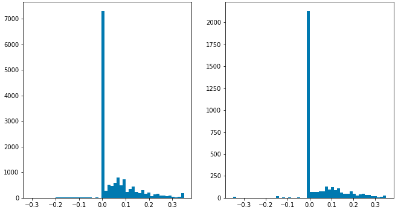
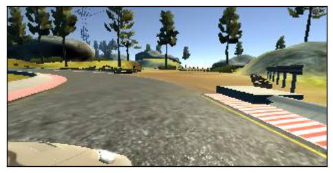

# Imitation Learning Lab

## PilotNet Lab

**Objective:** Vision-only navigation of a racing circuit, based on:

* <https://devblogs.nvidia.com/deep-learning-self-driving-cars/> Nvidia's blog post introducing the concept
* <https://arxiv.org/pdf/1704.07911.pdf> Nvidia's PilotNet paper
* <https://github.com/naokishibuya/car-behavioral-cloning> (using Udacity's simulator)

## Introduction

This lab provides an introduction to end-to-end imitation learning for vision-only navigation of a racetrack. There are two components to this lab. First, we will learn how to train a model (specifically, a *convolutional neural network*) in simulation. This will involve driving a simulated car around a virtual racetrack and collecting camera data from the rendered game engine. Then we will train another model using camera data and steering angles collected from the RACECAR platform in a real-world environment, Stata basement.


###In simulation:


###In Stata basement:

<iframe width="560" height="315" src="https://www.youtube.com/embed/tQCZjKa3Bpw" frameborder="0" allow="accelerometer; autoplay; encrypted-media; gyroscope; picture-in-picture" allowfullscreen></iframe>


## Training:

We will use three cameras mounted on the virtual and real-world RACECAR to collect training data. Excerpting from [Nvidia's blog post](https://devblogs.nvidia.com/deep-learning-self-driving-cars/):

> *Training data contains single images sampled from the video, paired with the corresponding steering command (1/r). Training with data from only the human driver is not sufficient; the network must also learn how to recover from any mistakes, or the car will slowly drift off the road. The training data is therefore augmented with additional images that show the car in different shifts from the center of the lane and rotations from the direction of the road.*
>
> *The images for two specific off-center shifts can be obtained from the left and the right cameras. Additional shifts between the cameras and all rotations are simulated through viewpoint transformation of the image from the nearest camera. Precise viewpoint transformation requires 3D scene knowledge which we don’t have, so we approximate the transformation by assuming all points below the horizon are on flat ground, and all points above the horizon are infinitely far away. This works fine for flat terrain*


Let us take a closer look at a Keras implementation of the CNN architecture:


Using TensorFlow's *Keras API*, let us look at an implementation of the above network in code:

!!! note "Exercise"
    How many parameters does each layer represent? What is the effect of changing the input size on the total number of parameters in the network? Why? 
    
    Hint: use `model.summary()` as a way to explore the effect of changing input size.

For more on TensorFlow's Keras API, [click here](https://tensorflow.org).

```python
from tensorflow.keras.layers import Lambda, Conv2D, MaxPooling2D, Dropout, Dense, Flatten
from tensorflow.keras.models import Sequential

# you will need to crop or shrink images to the dimensions you choose here:
IMAGE_HEIGHT, IMAGE_WIDTH, IMAGE_CHANNELS = 66, 200, 3
INPUT_SHAPE = (IMAGE_HEIGHT, IMAGE_WIDTH, IMAGE_CHANNELS)

def build_model(dropout_rate=0.5):
    model = Sequential()
    model.add(Lambda(lambda x: x/127.5-1.0, input_shape=INPUT_SHAPE)) #normalizes image data
    model.add(Conv2D(24, (5,5), strides=(2, 2), activation='elu'))
    model.add(Conv2D(36, (5,5), strides=(2, 2), activation='elu'))
    model.add(Conv2D(48, (5,5), strides=(2, 2), activation='elu'))
    model.add(Conv2D(64, (3,3), activation='elu'))
    model.add(Conv2D(64, (3,3), activation='elu'))
    model.add(Dropout(dropout_rate)) 
    model.add(Flatten())
    model.add(Dense(100, activation='elu'))
    model.add(Dense(50, activation='elu'))
    model.add(Dense(10, activation='elu'))
    model.add(Dense(1))
    model.summary()
    return model
```

!!! note
    Note that Keras will disable **Dropout regularization** at inference time. [See here](https://stackoverflow.com/questions/47787011/how-to-disable-dropout-while-prediction-in-keras) for details.


### Servo histogram

It is important to ensure the train/test split of the data you have collected have similar driving condition represented. For instance, here is the histogram of servo angles in the training and testing data used above:



### Extending to more general environments

It is possible to train a network with driving data from public roads, in order to experiment with how it affects the performance of your car in Stata basement.

!!! danger
    Obviously, you should not test anything on public roads yourself, either on a RACECAR or any other car. Be safe and responsible!


## Running inference

The following script will load a pre-trained model and drive the car through Stata basement:

```bash
$ # Optional -- mount SSD for data collection
$ # sudo mount -t auto /dev/sda1 /media/ssd/
$ roslaunch racecar_bringup base.launch teleop:=true
$ roslaunch zed_wrapper zed.launch
$ cd ~/pilotnet # or wherever you have basement-006.h5 weights stored
$ python pilotnet_drive.py
```

# Data collection

You will need to save images to the car's SSD:

In `zed.launch` (`$ roscd zed_wrapper`):

```xml
    <arg name="resolution"           default="3" /> <!--0=RESOLUTION_HD2K, 1=RESOLUTION_HD1080, 2=RESOLUTION_HD720, 3=RESOLUTION_VGA -->
    <arg name="frame_rate"           default="15" />
```

In **TODO** `launch/record_bag.launch`:

```xml
args="--output-prefix $(arg saveas) $(arg extra_args) /joy /racecar_drive /vesc/sensors/core /velodyne_packets /scan /imu/data_raw /imu/data /imu/mag /zed/left/image_raw_color/compressed /zed/right/image_raw_color/compressed /zed/left/camera_info /zed/right/camera_info" />
```

Then, to record the rosbag **TODO**: 

```bash
$ roslaunch racecar_bringup record_bag.launch saveas:=/media/ssd/rosbags/
```


### Image Augmentation

Example transformations:

**Center Image**


**Left and right Images**

```python
def choose_image(data_dir, center, left, right, steering_angle):
    """
    Randomly choose an image from the center, left or right, and adjust
    the steering angle.
    """
    choice = np.random.choice(3)
    if choice == 0:
        return load_image(data_dir, left), steering_angle + 0.2
    elif choice == 1:
        return load_image(data_dir, right), steering_angle - 0.2
    return load_image(data_dir, center), steering_angle
```

 


**Flipped Image**

```python
    if np.random.rand() < 0.5:
        image = cv2.flip(image, 1)
        steering_angle = -steering_angle
    return image, steering_angle
```


**Translated Image**

```python
def random_translate(image, steering_angle, range_x, range_y):
    """
    Randomly shift the image virtially and horizontally (translation).
    """
    trans_x = range_x * (np.random.rand() - 0.5)
    trans_y = range_y * (np.random.rand() - 0.5)
    steering_angle += trans_x * 0.002
    trans_m = np.float32([[1, 0, trans_x], [0, 1, trans_y]])
    height, width = image.shape[:2]
    image = cv2.warpAffine(image, trans_m, (width, height))
    return image, steering_angle
```

