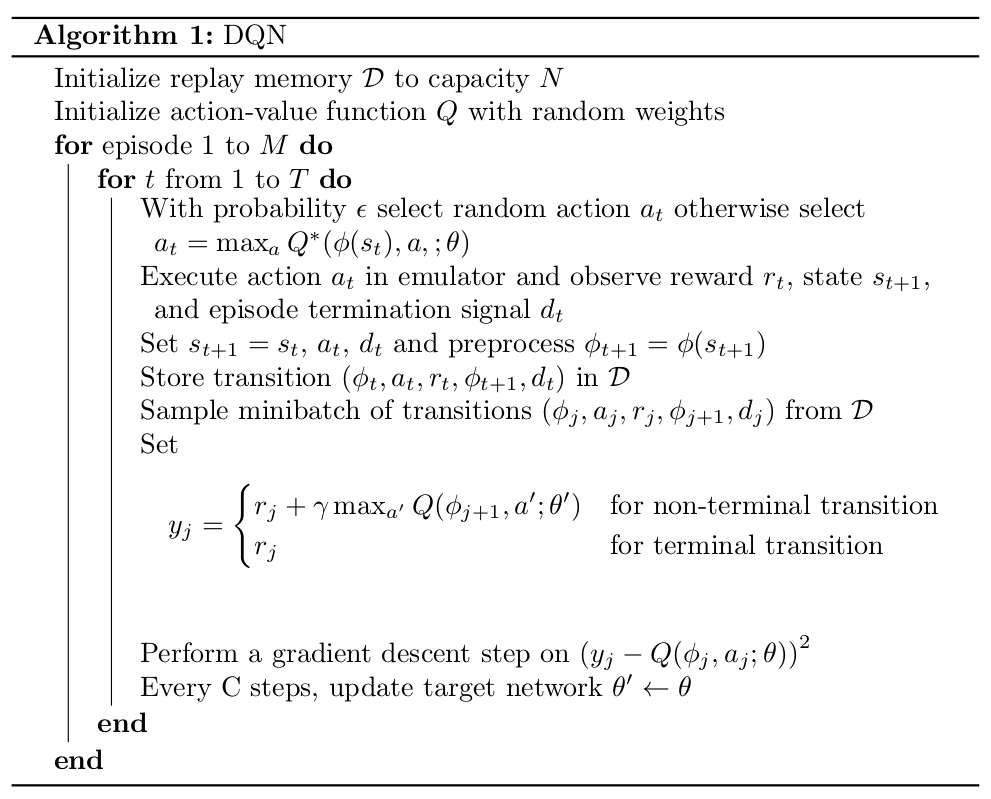

# Reinforcement Learning in Simulation

## Introduction

**Objective:** This lab is an introduction to *deep reinforcement learning* as a technique to avoid obstacles and navigate complex environments using only a camera for sensing.

Reinforcement learning is distinct from the imitation learning aproach: here, the robot learns to explore the environment on its own, with almost no information about the world or itself. Through exploration and *reinforcement,* rather than human-provided examples of behavior to imitate, the robot has the potential to learn novel and optimal techniques exceeding the abilities of humans.

From [Spinning Up in Deep RL](https://spinningup.openai.com/en/latest/spinningup/rl_intro.html)

> *The main characters of RL are the agent and the environment. The environment is the world that the agent lives in and interacts with. At every step of interaction, the agent sees a (possibly partial) observation of the state of the world, and then decides on an action to take. The environment changes when the agent acts on it, but may also change on its own.*
>
> *The agent also perceives a reward signal from the environment, a number that tells it how good or bad the current world state is. The goal of the agent is to maximize its cumulative reward, called return. Reinforcement learning methods are ways that the agent can learn behaviors to achieve its goal.*

$$P(\tau|\pi) = \rho_0 (s_0) \prod_{t=0}^{T-1} P(s_{t+1} | s_t, a_t) \pi(a_t | s_t)$$

<!-- The expected return (for whichever measure), denoted by $J(\pi)$ , is then:

$$J(\pi) = \int_{\tau} P(\tau|\pi) R(\tau) = \underE{\tau\sim \pi}{R(\tau)}$$
-->

The central optimization problem in RL can then be expressed by

$$\pi^* = \arg \max_{\pi} J(\pi)$$

## Gym Interface

This is a defacto-standard interface for reinforcement learning in simulation, popularized by OpenAI's Gym environment:

* `reset()`
* `step()` and frame-skipping
* `is_game_over()`

## The DQN Algorithm

