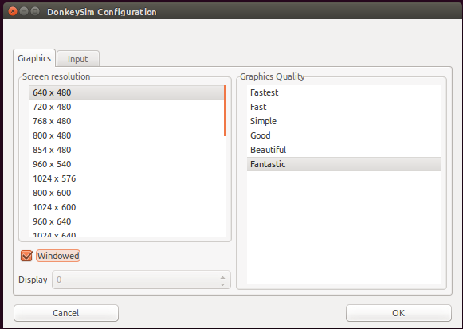

# Reinforcement Learning Lab

## Introduction

**Objective:** This lab exercise introduces *deep reinforcement learning* (Deep RL) for autonomous driving in simulation, using only a camera for sensing.

Reinforcement learning is distinct from imitation learning: here, the robot learns to explore the environment on its own, with practically no prior information about the world or itself. Through exploration and reinforcement of behaviors which net reward, rather than human-provided examples of behavior to imitate, a robot has the potential to learn novel, optimal techniques which exceed the abilities of humans. Atari games, Go, and StarCraft are settings in which Deep RL algorithms have approached or surpassed human experts in skill.

This lab relies on providing the robot with a simulation environment to use as a sandbox for exploration. In particular, we will use a Unity-based simulation environment originally developed by [Tawn Kramer](https://github.com/tawnkramer/) for the [DonkeyCar RC platform](https://www.donkeycar.com/).

This lab exercise relies on a Deep RL demonstration by [Antonin Raffin](https://github.com/araffin), which uses [*Proximal Policy Optimization (PPO)*](https://spinningup.openai.com/en/latest/algorithms/ppo.html) and [*Soft Actor-Critic (SAC)*](https://spinningup.openai.com/en/latest/algorithms/sac.html) to quickly train the simulated DonkeyCar to drive on a randomly generated track. This demonstration is itself a fork of an earlier repository by [Roma Sokolkov](https://github.com/r7vme), which leveraged another Deep RL algorithm [*Deep Deterministic Policy Gradient*](https://spinningup.openai.com/en/latest/algorithms/ddpg.html) in the simulator.

For the lab exercise we have forked Antonin Raffin's repository in case there are any lab-specific changes to distribute, but the lab fork is otherwise simply tracking the upstream repo by the original authors (Raffin, Sokolov, Kramer, and [other contributors/sources](https://github.com/mmaz/learning-to-drive-in-5-minutes#credits)):

```shell
$ git clone https://github.com/mmaz/learning-to-drive-in-5-minutes
```

Lastly, it is instructive to review [Antonin Raffin's blogpost](https://medium.com/@araffin/learning-to-drive-smoothly-in-minutes-450a7cdb35f4) on the testing he conducted, for ideas and background, as you work on the lab.

## A review of Reinforcement Learning

If needed, OpenAI's [Spinning Up in Deep RL](https://spinningup.openai.com/en/latest/spinningup/rl_intro.html) is an excellent way to review in greater depth the concepts discussed during lecture. In particular, the lab is based on topics covered in these sections:

* [Basic concepts in RL](https://spinningup.openai.com/en/latest/spinningup/rl_intro.html)
* [The derivation of policy gradients](https://spinningup.openai.com/en/latest/spinningup/rl_intro3.html)
* [The "vanilla PG" algorithm](https://spinningup.openai.com/en/latest/algorithms/vpg.html)
* [Proximal Policy Optimization (PPO)](https://spinningup.openai.com/en/latest/algorithms/ppo.html) 
* [Soft Actor-Critic (SAC)](https://spinningup.openai.com/en/latest/algorithms/sac.html)

## Gym Interface

"Gym" interfaces refer to a de facto-standard for reinforcement learning in simulation, popularized by [OpenAI's Gym environment](https://gym.openai.com/). Simulation environments frequently support variants of the following two calls:

* `reset()`
* `step()`

Calls to `step()` usually take in actions and return the next state, observed reward (if any), and auxillary information such as whether the episode is over (allowing the RL algorithm time to make decisions and optionally `reset()` the environment for the next episode). For a more in-depth explanation on the concepts in a Gym API, read <http://gym.openai.com/docs/>.


## Part 1: installing the DonkeyCar simulator

The following link is a Linux build of the Unity Donkey simulation environment from the original author: 

[Download on Google Drive](https://drive.google.com/open?id=1h2VfpGHlZetL5RAPZ79bhDRkvlfuB4Wb)

!!! note
    The simulation can also be built from source for other platforms, from [the `donkey` tree of the `sdsandbox` repo](https://github.com/tawnkramer/sdsandbox/tree/donkey) using the [Unity](https://unity.com/) development platform.

### Starting the simulator

After unzipping the folder and changing into the directory, launch the simulator with:

```
$ ./build_sdsandbox.x86_64
```

I suggest the following settings of `640x480`, `windowed`, and `Fantastic` rendering quality (but this wll depend on your graphics support):

{: style="width:80%;" }

### Simulator implementations of OpenAI Gym functions:

The following links to the simulator's Gym API implementation are provided as reference for your experimentation (changing the implementation is not necessary however). Note that editing these implementations will not require rebuilidng the simulator, making experimentation easier to conduct.

* `step()` is implemented through several callbacks:
    * [`take_action()`](https://github.com/mmaz/learning-to-drive-in-5-minutes/blob/89a3b2ca040014cb2193ad3fe88636de146f49ce/donkey_gym/envs/donkey_sim.py#L185-L197)
    * [`calc_reward()`](https://github.com/mmaz/learning-to-drive-in-5-minutes/blob/89a3b2ca040014cb2193ad3fe88636de146f49ce/donkey_gym/envs/donkey_sim.py#L219-L234) - note that this depends implicitly on the cross-track error reported by the simulator
    * [`on_telemetry()`](https://github.com/mmaz/learning-to-drive-in-5-minutes/blob/89a3b2ca040014cb2193ad3fe88636de146f49ce/donkey_gym/envs/donkey_sim.py#L238-L280) This recieves data from the simulator, including
        * front-bumper images from the simulated DonkeyCar
        * current steering angle and velocity
        * cross-track error ("cte")
* [`reset()`](https://github.com/mmaz/learning-to-drive-in-5-minutes/blob/89a3b2ca040014cb2193ad3fe88636de146f49ce/donkey_gym/envs/donkey_sim.py#L159-L177) sets all counters to zero
* [`is_game_over()`](https://github.com/mmaz/learning-to-drive-in-5-minutes/blob/89a3b2ca040014cb2193ad3fe88636de146f49ce/donkey_gym/envs/donkey_sim.py#L213-L217) is simply a combination of checking for collisions (not present in level 0) or crossing a threshhold of tolerated cross-track error

## Part 2: Installing Deep RL python dependencies 

!!! danger "Heads up!"
    If you are using an account on the NEET server, skip this step! These dependencies are already installed.


* If you **do not** have a GPU on your computer:
    
```shell
# Use TensorFlow without a GPU
$ conda env create -f environment.yml 
```
    
* Otherwise, if you **do** have a GPU:
    
```shell
# Use TensorFlow with a GPU
$ conda env create -f environment-gpu.yml
```

## Part 3: Training with the existing VAE

First, download [the pre-trained VAE from the author's Google Drive folder](https://drive.google.com/open?id=1n7FosFA0hALhuESf1j1yg-hERCnfVc4b) for Level0 in the same directory you cloned the repository into.

Next, launch the Unity environment (if it is not already running from **Part 1**)

To launch a newly initialized training run for the PPO algorithm across 5000 iterations, run the following command:

```shell
$ python train.py --algo ppo -vae vae-level-0-dim-32.pkl -n 5000
```

Alternatively, to launch a training run for *Soft Actor-Critic* (SAC):

```shell
$ python train.py --algo sac -vae vae-level-0-dim-32.pkl -n 5000
```

## Part 4: Experimenting with Deep RL

**TBD**

## Part 5: Retraining the VAE

**TBD**