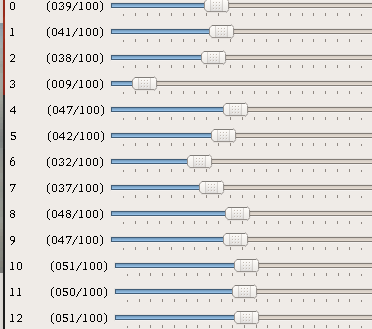

# Reinforcement Learning Lab

## Introduction

**Objective:** This lab exercise introduces *deep reinforcement learning* (Deep RL) for autonomous driving in simulation, using only a camera for sensing.

Reinforcement learning is distinct from imitation learning: here, the robot learns to explore the environment on its own, with practically no prior information about the world or itself. Through exploration and reinforcement of behaviors which net reward, rather than human-provided examples of behavior to imitate, a robot has the potential to learn novel, optimal techniques which exceed the abilities of humans. Atari games, Go, and StarCraft are a few well-known settings in which Deep RL algorithms have approached or surpassed human expertise.

This lab relies on providing the robot with a simulation environment to use as a sandbox for exploration. In particular, we will use a Unity-based simulation environment originally developed by [Tawn Kramer](https://github.com/tawnkramer/) for the [DonkeyCar RC platform](https://www.donkeycar.com/).

This lab exercise relies on a Deep RL demonstration by [Antonin Raffin](https://github.com/araffin), which uses [*Proximal Policy Optimization (PPO)*](https://spinningup.openai.com/en/latest/algorithms/ppo.html) and [*Soft Actor-Critic (SAC)*](https://spinningup.openai.com/en/latest/algorithms/sac.html) to quickly train the simulated DonkeyCar to drive on a randomly generated track (and also leverages a variational autoencoder based on code from [hardmaru](http://blog.otoro.net//2018/06/09/world-models-experiments/)). This demonstration is itself a fork of an earlier repository by [Roma Sokolkov](https://github.com/r7vme), which leveraged another Deep RL algorithm [*Deep Deterministic Policy Gradient*](https://spinningup.openai.com/en/latest/algorithms/ddpg.html) (DDPG) in the simulator.

It is instructive to review [Antonin Raffin's blogpost](https://medium.com/@araffin/learning-to-drive-smoothly-in-minutes-450a7cdb35f4) regarding the testing he conducted, for ideas and background, as you work on the lab.

For the lab exercise we have forked Antonin Raffin's repository in case there are any lab-specific changes to distribute, but the lab fork is otherwise simply tracking the upstream repo by the original authors (Raffin, Sokolov, Kramer, and [other contributors/sources](https://github.com/mmaz/learning-to-drive-in-5-minutes#credits)):

### Cloning the lab locally:

```shell
$ git clone https://github.com/mmaz/learning-to-drive-in-5-minutes
```

## A review of Reinforcement Learning

If needed, OpenAI's [Spinning Up in Deep RL](https://spinningup.openai.com/en/latest/spinningup/rl_intro.html) is an excellent way to review in greater depth the concepts discussed during lecture. In particular, the lab is based on topics covered in these sections:

* [Basic concepts in RL](https://spinningup.openai.com/en/latest/spinningup/rl_intro.html)
* [The derivation of policy gradients](https://spinningup.openai.com/en/latest/spinningup/rl_intro3.html)
* [The "vanilla PG" algorithm](https://spinningup.openai.com/en/latest/algorithms/vpg.html)
* [Proximal Policy Optimization (PPO)](https://spinningup.openai.com/en/latest/algorithms/ppo.html) 
* [Soft Actor-Critic (SAC)](https://spinningup.openai.com/en/latest/algorithms/sac.html)

## Gym Interface

"Gym" interfaces refer to a de facto-standard for reinforcement learning in simulation, popularized by [OpenAI's Gym environment](https://gym.openai.com/). Simulation environments frequently support variants of the following two calls:

* `reset()`
* `step()`

Calls to `step()` usually take in actions and return the next state, observed reward (if any), and auxillary information such as whether the episode is over (allowing the RL algorithm time to make decisions and optionally `reset()` the environment for the next episode). For a more in-depth explanation on the concepts in a Gym API, read <http://gym.openai.com/docs/>.

## State-space Dimensionality Reduction

A **variational autoencoder** or VAE is used to reduce the size of the state space that the policy must consider at training and inference time. The state space is represented as a small vector of floating point numbers (e.g., 20-30) taken from the VAE's bottleneck encoding (i.e., the "latent space" encoding), instead of the full image.

[This lecture](https://www.youtube.com/watch?v=uaaqyVS9-rM) from Prof. Ali Ghodsi at the University of Waterloo is an excellent, brief, and self-contained introduction to the theory and implementation of VAEs. For additional reading, please consult one or more of these references (or inquire during office hours/over Slack):

* Ali Ghodsi's lecture: <https://www.youtube.com/watch?v=uaaqyVS9-rM>
* <https://jaan.io/what-is-variational-autoencoder-vae-tutorial/>
* <https://www.tensorflow.org/alpha/tutorials/generative/cvae>
* <https://blog.keras.io/building-autoencoders-in-keras.html>
* Fast-forward Labs blog [Part 1](https://blog.fastforwardlabs.com/2016/08/12/introducing-variational-autoencoders-in-prose-and.html) and [Part 2](https://blog.fastforwardlabs.com/2016/08/22/under-the-hood-of-the-variational-autoencoder-in.html)
* [hardmaru](https://github.com/hardmaru)'s series of posts on world models: <http://blog.otoro.net//2018/06/09/world-models-experiments/>

## Part 1: Downloading the DonkeyCar simulation environment

The following link is a Linux build of the Unity Donkey simulation environment from the original author: 

[Download on Google Drive](https://drive.google.com/open?id=1h2VfpGHlZetL5RAPZ79bhDRkvlfuB4Wb)

!!! note
    The simulation can also be built from source for other platforms, from [the `donkey` tree of the `sdsandbox` repo](https://github.com/tawnkramer/sdsandbox/tree/donkey) using the [Unity](https://unity.com/) development platform.

### Starting the simulator

After unzipping the folder and changing into the directory, launch the simulator with:

```
$ ./build_sdsandbox.x86_64
```

I suggest the following settings of `640x480`, `windowed`, and `Fantastic` rendering quality (but this wll depend on your graphics support):

{: style="width:80%;" }

### Simulator implementations of OpenAI Gym functions:

The following links to the simulator's Gym API implementation are provided as reference for your experimentation (changing the implementation is not necessary however). Note that editing these implementations will not require rebuilidng the simulator, making experimentation easier to conduct.

* `step()` is implemented through several callbacks:
    * [`take_action()`](https://github.com/mmaz/learning-to-drive-in-5-minutes/blob/89a3b2ca040014cb2193ad3fe88636de146f49ce/donkey_gym/envs/donkey_sim.py#L185-L197)
    * [`calc_reward()`](https://github.com/mmaz/learning-to-drive-in-5-minutes/blob/89a3b2ca040014cb2193ad3fe88636de146f49ce/donkey_gym/envs/donkey_sim.py#L219-L234) - note that this depends implicitly on the cross-track error reported by the simulator
    * [`on_telemetry()`](https://github.com/mmaz/learning-to-drive-in-5-minutes/blob/89a3b2ca040014cb2193ad3fe88636de146f49ce/donkey_gym/envs/donkey_sim.py#L238-L280) This recieves data from the simulator, including
        * front-bumper images from the simulated DonkeyCar
        * current steering angle and velocity
        * cross-track error ("cte")
* [`reset()`](https://github.com/mmaz/learning-to-drive-in-5-minutes/blob/89a3b2ca040014cb2193ad3fe88636de146f49ce/donkey_gym/envs/donkey_sim.py#L159-L177) sets all counters to zero
* [`is_game_over()`](https://github.com/mmaz/learning-to-drive-in-5-minutes/blob/89a3b2ca040014cb2193ad3fe88636de146f49ce/donkey_gym/envs/donkey_sim.py#L213-L217) is simply a combination of checking for collisions (not present in level 0) or crossing a threshhold of tolerated cross-track error

## Part 2: Installing Deep RL python dependencies 

!!! danger "Heads up!"
    If you are using an account on the NEET server, skip this step! These dependencies are already installed.


* If you **do not** have a GPU on your computer:
    
```shell
# Use TensorFlow without a GPU
$ conda env create -f environment.yml 
```
    
* Otherwise, if you **do** have a GPU:
    
```shell
# Use TensorFlow with a GPU
$ conda env create -f environment-gpu.yml
```

## Part 3: Training a policy with a pre-trained VAE

First, download [the pre-trained VAE from the author's Google Drive folder](https://drive.google.com/open?id=1n7FosFA0hALhuESf1j1yg-hERCnfVc4b) for Level0 in the same directory you cloned the repository into.

Next, launch the Unity environment (if it is not already running from **Part 1**)

To launch a newly initialized training run for the PPO algorithm across 5000 iterations in *Level 0* of the simulator, run the following command:

```shell
$ python train.py --algo ppo -vae vae-level-0-dim-32.pkl -n 5000
```

Alternatively, to launch a training run for *Soft Actor-Critic* (SAC):

```shell
$ python train.py --algo sac -vae vae-level-0-dim-32.pkl -n 5000
```

Is 5000 steps enough to train a good policy for PPO or SAC? How frequently does training converge on a good policy (versus performance collapse)?

## Part 4: Experimenting with Deep RL

Once you have tried training a policy in the simulation environment, you can experiment with changing the existing algorithms, or try a different Deep RL algorithm altogether, such as [TRPO](http://spinningup.openai.com/en/latest/algorithms/trpo.html), [TD3](http://spinningup.openai.com/en/latest/algorithms/td3.html), etc.

The goal of this section of the lab is to gain some intuition and experience with training the vehicle's policy using deep reinforcement learning, through modifying the existing code, hyperparameters, and algorithms, or by incorporating new algorithms. Your experimentation can target one or more threads of investigation (this is a non-exhaustive list):

* How can the training performance (accuracy/speed/etc) and learned policy's effectiveness be visualized or quantified?
* What is the effect of tuning hyperparameters on the convergence time and robustness (or lack thereof) of algorithms like PPO and SAC?
* What changes to the algorithm can be made to improve convergence behaviors and the robustness of the learned policy?
 
Here are a few examples of possible things to try (again, non-exhaustive):
  
* Visualize the policy's training performance (e.g., with [tensorboard](https://www.tensorflow.org/guide/summaries_and_tensorboard))
* Visualize the value network's training performance (if you are using an actor-critic algorithm like PPO)
* Alter the hand-crafted [reward function](https://github.com/mmaz/learning-to-drive-in-5-minutes/blob/89a3b2ca040014cb2193ad3fe88636de146f49ce/donkey_gym/envs/donkey_sim.py#L219-L234) by stating a hypothesis, changing the reward calculation, and retraining.
    * See [Antonin Raffin's blogpost](https://medium.com/@araffin/learning-to-drive-smoothly-in-minutes-450a7cdb35f4) for his explanation of the current reward function
    * An example hypothesis: perhaps the current implementation of the 'smooth' steering constraint is leading to frequent performance collapse - an alternative implementation may do better.
* Quantify the variance of a trained policy
    * E.g., what is the distribution of collected reward across multiple trajectories using a trained policy? Can this be used to inform further training of the policy?
* Change the network to use pixels directly instead of using the VAE encoding.
    * Suggestion: Consider using a CNN instead of a dense network, and explore augmentation/subsampling.
* Train a policy that can drive on random roads (the simulator is currently set up to use the same road for every episode)
* Replace the pre-trained VAE with one you trained yourself on collected data in the simulator (this is the first component of **Part 5** below)


## Part 5: Retraining the VAE

You can sample from the pre-trained VAE's manifold with the following command:

```shell
$ python -m vae.enjoy_latent -vae vae-level-0-dim-32.pkl
```

You can move some of the sliders around and "generate" new views of the track by running the encoded representation through the deconvolutional portion of the VAE network.  

{: style="width:40%;" }

See the video below for an example output:

<video controls src="../img/vae.mp4"></video>

To get some hands-on experience with VAEs, collect a new set of images and train a new VAE, instead of using the pre-trained VAE. Optionally consider using a different network architecture (for instance, some recent VAE research has focused on improved disentangling of latent factors, such as [this IBM paper](https://www.ibm.com/blogs/research/2018/05/disentanglement-deep-learning/) among others).

You can use the [VAE training script](https://github.com/mmaz/learning-to-drive-in-5-minutes/blob/master/vae/train.py) and train on new data via:

```shell
$ python -m vae.train --n-epochs 50 --verbose 0 --z-size 64 -f path-to-record/folder/
```

where `z-size` specifies the number of latent factors in the bottleneck.

Next, try to train a new VAE network on real-world data, e.g., using the camera images you collected in the [Imitation Learning Lab](imitation_learning.md) from a classroom or the full Stata basement track. Visualize samples from the manifold of this VAE. 

!!! note "Optional Exercise"
    If you are feeling particularly eager and have the time, you could use this VAE to train the RACECAR in a classroom or even in Stata basement! You might want to set up a few extra Traxxas batteries to keep charging and swapping out, because this could take an hour or more of driving on-policy, physically resetting when the car gets near an obstacle or veers off course, retraining, and repeating.